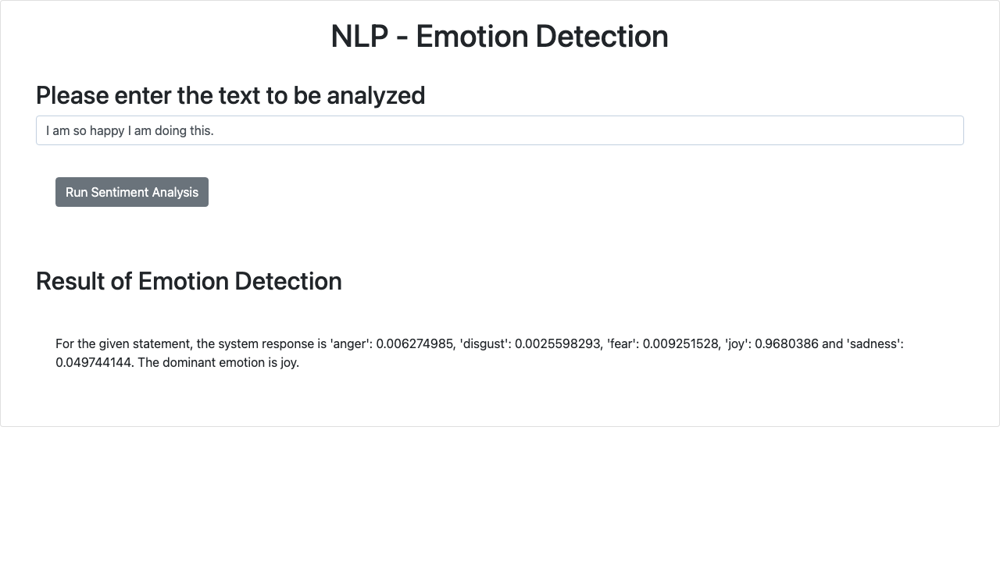
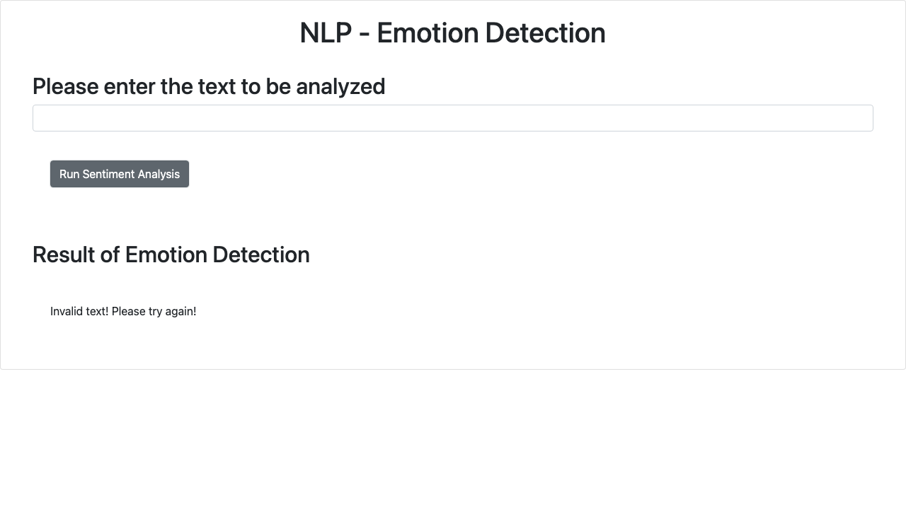

# Emotion Detection Web Application

Final project for **Developing AI Applications with Python and Flask** (IBM Skills Network).

An AI-based web app that analyses customer feedback text and detects the
emotion expressed (anger, disgust, fear, joy, sadness) using the embeddable
Watson NLP library. The app is packaged as the `EmotionDetection` Python
package, deployed with Flask, and passes pylint with a perfect 10/10 score.

## Project structure

```
EmotionDetection/
    __init__.py              # exposes emotion_detector
    emotion_detection.py     # calls Watson NLP EmotionPredict, handles HTTP 400
templates/index.html         # front end
static/mywebscript.js        # front-end script
server.py                    # Flask web server (/ and /emotionDetector)
test_emotion_detection.py    # unit tests
screenshots/                 # deployment and error-handling screenshots
requirements.txt
SUBMISSION.md                # answers for the 16 rubric items
```

## Setup

```bash
pip install -r requirements.txt
```

## Usage

```python
>>> from EmotionDetection import emotion_detector
>>> emotion_detector("I am so happy I am doing this.")
{'anger': 0.006274985, 'disgust': 0.0025598293, 'fear': 0.009251528, 'joy': 0.9680386, 'sadness': 0.049744144, 'dominant_emotion': 'joy'}
```

Blank or invalid input (Watson returns HTTP 400) yields `None` for every key,
and the web app shows `Invalid text! Please try again!`.

## Run the unit tests

```bash
python3 -m unittest test_emotion_detection.py
```

## Run the web app

```bash
python3 server.py
```

Then open <http://localhost:5000>, enter text, and click **Run Sentiment Analysis**.

### Deployment



### Error handling (blank input)



## Static code analysis

```bash
$ pylint server.py
Your code has been rated at 10.00/10
```

## Note on the Watson NLP endpoint

`emotion_detector` calls
`https://sn-watson-emotion.labs.skills.network/.../EmotionPredict`, which is
only reachable from inside the Skills Network lab environment.
